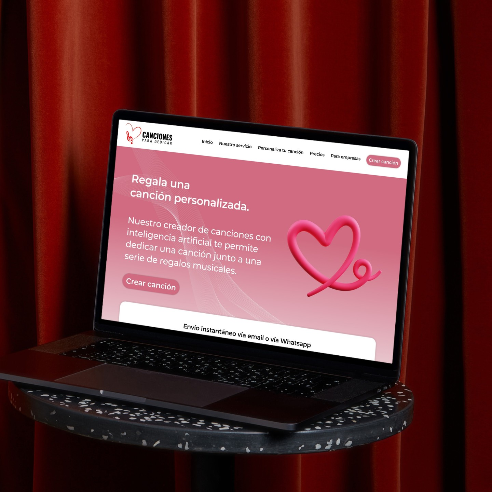

<h2 align="center">Diseño Figma: <a href="https://www.figma.com/design/Ir0zO6uEfChEsAdEFWfogE/Cancionesparadedicar?t=Dd2Umq7QV8PAjlEc-0">Maquetado en Figma</a></h2>

<h2 align="center">Página: <a href="https://canciones-ia.vercel.app/">canciones.com</a></h2>

<h2 >Tecnologías usadas👨🏻‍💻</h2>
 
<h4>Front end: </h4>

<h4>Servicios: </h4>

<h4>IDEs: </h4>

<h4>Apps:</h4>

<h1>Canciones para dedicar</h1>

Bienvenido al proyecto Canciones para Dedicar con IA. Este sitio permite crear canciones personalizadas mediante inteligencia artificial, facilitando la dedicación de canciones de manera rápida y sencilla.

<h2>Resumen</h2>

La plataforma permite a los usuarios dedicar canciones personalizadas generadas por IA, transformando la forma en que se comparten emociones a través de la música.

<h2>Características</h2>

<ul>
    <li><strong>Diseño Responsive:</strong> La aplicación está diseñada para funcionar perfectamente en diferentes dispositivos y tamaños de pantalla, proporcionando una experiencia de usuario consistente.</li>
    <li><strong>Creación de Canciones Personalizadas:</strong>Utiliza IA para componer y escribir canciones adaptadas a tus necesidades.</li>
    <li><strong>Interfaz Amigable:</strong>Navegación intuitiva que facilita el uso para todos los usuarios.</li>
</ul>

<h2>Tecnologías Utilizadas</h2>

<ul>
    <li><strong>HTML5:</strong> Utilizado para estructurar el contenido de las páginas web.</li>
    <li><strong>CSS3 (Sass):</strong> Utilizado para estilar la interfaz de usuario y crear diseños responsivos.</li>
    <li><strong>JavaScript (Vanilla JS, jQuery):</strong> Utilizado para implementar características interactivas y mejorar la experiencia del usuario.</li>
</ul>

<h2>Empezando</h2>

Para comenzar con el proyecto frontend de Easybank, sigue estos pasos:

<ol>
    <li>Clona este repositorio en tu máquina local usando <code>git clone</code>.</li>
    <li>Abre el directorio del proyecto en tu editor de código.</li>
    <li>Explora los archivos del proyecto y revisa el código HTML, CSS y JavaScript.</li>
    <li>Realiza cambios o adiciones según sea necesario para personalizar el proyecto según tus preferencias o practicar habilidades frontend específicas.</li>
    <li>Prueba la aplicación localmente abriendo el archivo <code>index.html</code> en un navegador web.</li>
</ol>

<h2>Contribuciones</h2>

¡Las contribuciones al proyecto son bienvenidas! Si tienes ideas para mejoras, correcciones de errores o nuevas características, no dudes en abrir un problema o enviar una solicitud de extracción.

<h2>Licencia</h2>

Este proyecto está bajo la <a href="LICENSE">Licencia MIT</a>.
